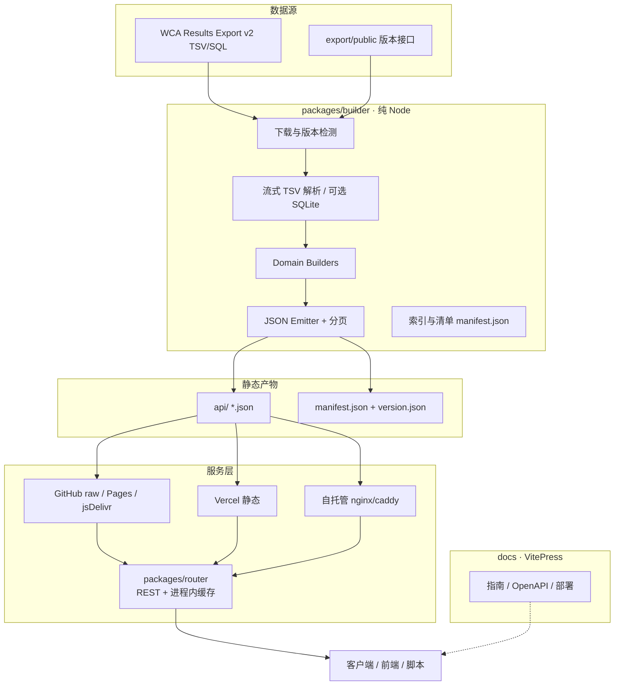

# WCA Data Router — 项目开发方案

> 版本：v0.1（审阅稿）
> 状态：**待确认，未开始实现**
> 日期：2026-09-24

---

## 1. 项目概述

将 [robiningelbrecht/wca-rest-api](https://github.com/robiningelbrecht/wca-rest-api)（PHP + MySQL）改写为：

1. **纯 Node 静态 API 构建器**：从 WCA Results Export 生成可静态托管的 JSON API；
2. **REST 路由器（router）**：在静态数据之上提供友好 REST 契约 + 进程内响应缓存（不引入外部缓存服务）；
3. **VitePress 文档站**（`docs/`）；
4. **GitHub Actions 每日构建与发布**，静态产物可部署到 **GitHub Pages / Vercel / 自托管静态服务器**。

项目名沿用工作区：`wca-data-router`。

**免责声明（必须保留）**：数据来自 WCA Results Export，需在文档与 `version.json` 中声明数据归属与导出日期。

---

## 2. 目标与非目标

### 目标

| # | 目标 | 验收标准 |
|---|------|----------|
| G1 | 纯 Node 构建静态 API | 不依赖 MySQL / PHP；CI 上 `node`/`bun` 可完整构建 |
| G2 | 每日自动更新 | GitHub Actions 定时任务检测新 export 后重建并发布 |
| G3 | 多平台静态托管 | 同一份 `api/` 产物可服务于 GH Pages、Vercel、nginx |
| G4 | REST router | 路由、分页/过滤、响应缓存、OpenAPI |
| G5 | 完整文档 | VitePress：快速开始、API 契约、部署指南、开发指南 |
| G6 | 接口可兼容参考项目 | 静态路径与 JSON 模型尽量兼容 `wca-rest-api` v1 |

### 非目标

- 实时数据（WCA export 本身按比赛周末更新，本项目最多每日一次）；
- 全量 scrambles 对外 API（体量过大，默认只在构建层可选支持）；
- 用户认证 / 写操作 / 数据库服务；
- 外部共享缓存服务（Redis/Memcached 等）或数据库缓存（**明确不做**，缓存只在进程内）。

---

## 3. 参考项目分析（wca-rest-api）

### 3.1 现有架构

```
WCA Export (SQL zip)
    → MySQL 导入 + 加索引
    → PHP Domain Command Handlers
    → Flysystem 写出 /api/**/*.json
    → orphan 分支 v1（raw.githubusercontent.com 直连）
文档：docs/ + Redoc 展示 openapi.yml → GitHub Pages
CI：cron 11:30 UTC，对比 /api/v0/export/public 与 v1/version.json
```

### 3.2 静态文件布局（v1，将作为兼容基线）

```
api/
  version.json
  continents.json
  countries.json
  events.json
  competitions.json
  competitions-page-{n}.json          # n≥2；page 1 同 competitions.json
  competitions/{id}.json
  competitions/{ISO2}.json            # 国家筛选
  competitions/{year}.json
  competitions/{year}/{month}.json
  competitions/{year}/{month}/{day}.json
  competitions/{eventId}.json
  competitions/{eventId}-page-{n}.json
  championships.json
  championships-page-{n}.json
  championships/{id}.json
  championships/{type}.json           # world | 大洲 slug | 国家 ISO2
  persons.json
  persons-page-{n}.json
  persons/{wcaId}.json                # 体量最大：~20 万+ 文件
  rank/{region}/{type}/{event}.json   # 仅 Top 1000；type ∈ single|average
  results/{competitionId}.json
  results/{competitionId}/{eventId}.json
```

列表信封（Overview）：

```json
{ "pagination": { "page": 1, "size": 1000 }, "total": 3465, "items": [] }
```

- 分页固定 `size=1000`；
- `rank` 仅输出前 1000 名（完整个人排名嵌在 `persons/{id}.json`）。

### 3.3 数据模型（导出字段 → API JSON）

| 实体 | 核心字段 | 备注 |
|------|----------|------|
| Continent | id, name | |
| Country | iso2Code, name | |
| Event | id, name, format | format: time/number/multi |
| Competition | id, name, city, country, date{from,till,numberOfDays}, isCanceled, events[], wcaDelegates[], organisers[], venue{}, information, externalWebsite | v2 列名：`delegates`/`organizers`/`latitude_microdegrees` |
| Championship | Competition + region | |
| Person | id, name, slug, country, competitionIds[], championshipIds[], rank{singles,averages}, medals, records, results 嵌套 | **单文件很大** |
| Rank | rankType, personId, eventId, best, rank{world,continent,country} | |
| Result | competitionId, personId, eventId, round, position, best, average, format, solves[5] | v2：`result_attempts` 取代 `value1-5`，对外仍 **补零到 5** 以兼容 |

### 3.4 参考实现的痛点（本项目要解决）

1. **构建极慢**：Person 约 51 分钟、Rank 约 24 分钟（PHP + MySQL + 逐条文件写）；
2. **MySQL 重依赖**：CI 起 MySQL 服务、调 bulk import 参数；
3. **文件爆炸**：`persons/*.json` 约 20 万文件，git 发布沉重；
4. **静态路径表达力弱**：`competitions/{id}` 与 `competitions/{year}` 同层冲突，靠约定区分；
5. **无统一 HTTP 入口**：只能 raw URL 直连，无友好 REST、无缓存层、无统一 404/错误契约。

---

## 4. 总体架构



**数据面（静态 JSON）** 与 **控制面（router）** 分离：

- 只要静态托管 → 可直接消费 `api/**/*.json`；
- 需要 REST、过滤、分页、稳定域名 → 走 router；
- 两者消费**同一套**构建产物，避免双份数据。

---

## 5. Monorepo 结构（GitHub 标准项目布局）

```text
wca-data-router/
├── .github/
│   ├── workflows/
│   │   ├── ci.yml                 # PR/push：lint + typecheck + unit test
│   │   ├── build-api.yml          # 每日构建静态 API 并发布 api 分支
│   │   └── deploy-docs.yml        # VitePress → GitHub Pages
│   ├── ISSUE_TEMPLATE/
│   └── PULL_REQUEST_TEMPLATE.md
├── docs/                          # VitePress 站点源码
│   ├── .vitepress/
│   │   ├── config.ts
│   │   └── theme/
│   ├── public/
│   ├── guide/
│   │   ├── introduction.md
│   │   ├── quick-start.md
│   │   ├── data-model.md
│   │   ├── static-layout.md
│   │   └── migration-from-v1.md   # 相对 wca-rest-api 的差异
│   ├── api/
│   │   ├── overview.md
│   │   ├── general.md
│   │   ├── competition.md
│   │   ├── championship.md
│   │   ├── person.md
│   │   ├── rank.md
│   │   ├── result.md
│   │   └── router.md              # REST 路由
│   ├── deploy/
│   │   ├── github-pages.md
│   │   ├── vercel.md
│   │   └── self-hosted.md
│   ├── openapi.yml                # 或从 router 生成
│   └── index.md
├── packages/
│   ├── shared/                    # 共享类型、路径映射、常量、Overview 约定
│   │   ├── src/
│   │   │   ├── types.ts
│   │   │   ├── overview.ts
│   │   │   ├── paths.ts           # 静态路径 ↔ 资源映射（单一事实来源）
│   │   │   └── version.ts
│   │   └── package.json
│   ├── builder/                   # 静态 API 构建器（CLI）
│   │   ├── src/
│   │   │   ├── cli.ts
│   │   │   ├── pipeline.ts
│   │   │   ├── ingest/
│   │   │   │   ├── download.ts
│   │   │   │   ├── tsv.ts
│   │   │   │   └── schema.ts      # 表结构（v2.0.2）
│   │   │   ├── store/
│   │   │   │   └── memory-store.ts
│   │   │   ├── builders/
│   │   │   │   ├── continent.ts
│   │   │   │   ├── country.ts
│   │   │   │   ├── event.ts
│   │   │   │   ├── competition.ts
│   │   │   │   ├── championship.ts
│   │   │   │   ├── person.ts
│   │   │   │   ├── rank.ts
│   │   │   │   ├── result.ts
│   │   │   │   └── version.ts
│   │   │   ├── emit/
│   │   │   │   ├── json-writer.ts
│   │   │   │   └── overview.ts
│   │   │   └── util/
│   │   │       ├── progress.ts
│   │   │       ├── slug.ts
│   │   │       └── solves.ts      # result_attempts → solves[5]
│   │   ├── test/
│   │   └── package.json
│   └── router/                    # REST 服务
│       ├── src/
│       │   ├── index.ts
│       │   ├── app.ts
│       │   ├── config.ts
│       │   ├── routes/
│       │   │   ├── health.ts
│       │   │   ├── meta.ts        # /v1/version
│       │   │   ├── general.ts
│       │   │   ├── competitions.ts
│       │   │   ├── championships.ts
│       │   │   ├── persons.ts
│       │   │   ├── ranks.ts
│       │   │   └── results.ts
│       │   ├── cache/
│       │   │   ├── lru.ts         # LRU + TTL + 负缓存
│       │   │   └── keys.ts
│       │   ├── datasource/
│       │   │   ├── static-source.ts  # 本地目录 / HTTP 静态源
│       │   │   └── resolve.ts        # 路径解析（复用 shared/paths）
│       │   └── openapi.ts
│       ├── test/
│       └── package.json
├── api/                           # 构建输出（.gitignore；由 CI 发布到 api 分支）
├── scripts/
│   ├── check-export-version.mjs
│   └── verify-static-samples.mjs
├── .gitignore
├── .editorconfig
├── LICENSE                        # Apache-2.0（与参考项目一致）
├── README.md
├── PLAN.md                        # 本文件
├── package.json                   # pnpm workspace 根
├── pnpm-workspace.yaml
├── tsconfig.base.json
└── biome.json                     # 或 eslint.config.js + prettier
```

> `ref/wca-rest-api/` 仅本地阅读参考，**不进入仓库**。

---

## 6. 静态 API 构建器（packages/builder）

### 6.1 技术路线（关键决策）

| 方案 | 说明 | 结论 |
|------|------|------|
| A. **TSV 流式解析 → 内存索引** | 下载 `*.tsv.zip`，按表流式读入紧凑结构，再物化 JSON | **主路径**（无 DB、依赖最少、符合“纯 Node”） |
| B. SQLite 中间库 | TSV → better-sqlite3 → SQL 查询 | **降级路径**（内存不足或需要复杂 join 时启用） |
| C. 解析 MySQL SQL dump | 同参考项目 | 不采用（解析成本高、无收益） |

**Export 选择**：默认 **TSV v2**（`/export/results/v2/tsv`），约 360MB zip。

版本检测：

```text
GET https://www.worldcubeassociation.org/api/v0/export/public
→ { export_date, export_format_version, sql_url, tsv_url, ... }
与 api/version.json（或 api 分支 raw）对比 export_date，决定是否重建。
```

### 6.2 构建流水线

```text
1. download     拉取 export/public；若 export_date 未变则 exit 0
2. fetch-tsv    下载 TSV zip → 解压到 .work/export/
3. load         流式解析所需表 → MemoryStore
4. build-*      按实体物化 JSON（可并行的实体用 worker_threads）
5. emit-meta    version.json + manifest.json + README 版本占位替换
6. verify       抽样校验 JSON 形状与文件计数
7. (CI) publish 发布 api/ → orphan 分支 `api`
```

### 6.3 需要解析的表（Export v2.0.2）

| 表 | 用途 |
|----|------|
| continents | Continent API |
| countries | Country API + competition/rank 关联 |
| events | Event API + 排序 |
| competitions | Competition API + 日期/国家/项目索引 |
| championships | Championship API |
| persons | Person API（`sub_id=1` 为主记录） |
| results | Result API + Person 嵌套成绩 |
| result_attempts | 拼 `solves[5]` |
| ranks_single / ranks_average | Rank API + Person 排名 |
| round_types / formats | round 名称、final 标记、format 名称 |

可选（默认跳过以控体积）：`scrambles`、`eligible_country_iso2s_for_championship`。

### 6.4 性能策略（相对 PHP 77 分钟的目标）

| 手段 | 预期收益 |
|------|----------|
| 单遍流式 TSV，列裁剪成 TypedArray/紧凑 tuple | 降低内存与解析时间 |
| 建立 `person_id → result indices` 倒排，避免 N+1 | Person 组装从 O(N²) 降到 O(N) |
| `worker_threads` 并行写 `persons/*`、`competitions/*` | 多核利用 |
| 并发文件写（p-limit ≈ 32–64） | 消除 IO 等待 |
| 可选增量：只重建变更实体（manifest 对比） | 日常无新赛时秒退 |
| 构建目标 | **全量 ≤ 15 分钟**（GitHub ubuntu-latest）；无变更 ≤ 30 秒 |

### 6.5 JSON 契约（兼容 + 小幅增强）

**保持兼容**（与 v1 一致）：

- Overview 信封：`{ pagination, total, items }`；
- 默认 `size=1000`；
- 实体字段名与嵌套结构对齐 `docs/openapi.yml`；
- `solves` 长度固定 5，不足补 `0`。

**增强（文档中标注为 `v1.1 / router`）**：

| 增强 | 说明 |
|------|------|
| `meta` 信封可选字段 | `export_date`、`generated_at`（router 可附加，静态文件默认不加以免破坏兼容） |
| Person 列表瘦身 | `persons.json` / `persons-page-*.json` 仅含摘要（id/name/slug/country/medals），**不含** `results` 嵌套；完整详情只在 `persons/{id}.json` |
| `persons/{id}/results.json` | 可选拆分，降低超大选手单文件体积 |
| `manifest.json` | 列出资源类型、数量、生成时间，便于 router 与客户端发现 |
| 路径冲突消解 | `competitions/{year}` 仅匹配 `^\d{4}$`；`{ISO2}` 仅匹配国家表；`{eventId}` 仅匹配 events；其余归 `{id}` |

### 6.6 Person 文件规模对策

约 20 万+ 详情文件会让 git 发布变慢。方案：

1. **默认**：保持 `persons/{wcaId}.json` 兼容布局（便于 raw URL 与缓存）；
2. **CI 发布优化**：`api` orphan 分支 + `git lfs` **不用**；改用「批量写 + 单 commit」；
3. **可选产物**（config 开关 `PERSON_SHARD=true`）：`persons/shard/{aa}/{wcaId}.json`（按 WCA ID 前 2 位分片），router 负责路由到分片，静态直连用户用 `manifest` 索引；
4. 若平台文件数受限（如某些 Pages 场景）：仅发布列表 + rank + competitions + results，Person 详情由 router 从「合并 NDJSON 索引」按需切片提供（router 仍只用内存缓存，合并索引是**静态数据文件**，不是数据库）。

**建议默认**：1 + 2；3 作为 flag；4 作为降级部署 profile。

### 6.7 CLI

```bash
# 全量构建
pnpm --filter @wca/builder build --out api

# 指定实体（调试）
pnpm --filter @wca/builder build --only continent,country,event

# 使用本地 TSV（跳过下载）
pnpm --filter @wca/builder build --from .work/export --out api

# 强制重建（忽略版本比对）
pnpm --filter @wca/builder build --force
```

---

## 7. 路由器（packages/router）

### 7.1 职责

1. 提供**稳定、可读**的 REST 契约（不必记忆 raw 文件路径）；
2. 在静态 JSON 之上做**查询参数过滤/分页**（必要时读列表文件再切片）；
3. 进程内缓存加速重复读；
4. 统一错误、CORS、ETag/Cache-Control、OpenAPI；
5. 可指向多种静态源（本地目录、GitHub raw、jsDelivr、自托管）。

### 7.2 REST 契约（`/v1`）

| Method | Path | 静态映射 / 行为 |
|--------|------|-----------------|
| GET | `/health` | 进程健康 |
| GET | `/v1/version` | `version.json` |
| GET | `/v1/continents` | `continents.json` |
| GET | `/v1/countries` | `countries.json` |
| GET | `/v1/events` | `events.json` |
| GET | `/v1/competitions` | `competitions*.json`；query: `page,size,country,year,month,day,event` |
| GET | `/v1/competitions/:id` | `competitions/{id}.json` |
| GET | `/v1/championships` | query: `page,size,type` |
| GET | `/v1/championships/:id` | `championships/{id}.json` |
| GET | `/v1/persons` | query: `page,size`（摘要列表） |
| GET | `/v1/persons/:id` | `persons/{id}.json` |
| GET | `/v1/ranks/:region/:type/:event` | `rank/{region}/{type}/{event}.json`；query: `page,size` |
| GET | `/v1/results/:competitionId` | `results/{competitionId}.json` |
| GET | `/v1/results/:competitionId/:eventId` | `results/{competitionId}/{eventId}.json` |
| GET | `/openapi.json` | 生成的 OpenAPI 3 |

响应信封：

- 集合：沿用 `{ pagination, total, items }`（保证与静态文件一致）；
- 单体：资源本体；
- 404：`{ error: { code: "NOT_FOUND", message, resource } }`；
- 可选 `X-Cache: HIT|MISS`、`ETag`、`Cache-Control: public, max-age=…`。

> 说明：静态文件无法原生支持任意 `page/size/过滤`。router 的策略是 **读对应静态切片，再在内存中组合/切片**；缓存的是「原始 JSON 对象」与「最终响应字符串」。

### 7.3 缓存设计（进程内，无外部缓存服务）

```text
┌─────────────────────────────────────────┐
│ MemoryCache                             │
│  - LRU（默认 max 512 entries / 256MB）   │
│  - TTL（默认 300s，可配置）              │
│  - 负缓存 404（TTL 60s）                 │
│  - 单飞 in-flight dedupe（防止缓存击穿） │
│  - version 指纹失效：export_date 变则全清 │
└─────────────────────────────────────────┘
```

| 策略 | 取值（默认） | 说明 |
|------|--------------|------|
| 算法 | LRU | `lru-cache` 或自研 Map+双向链表 |
| 粒度 | 资源 key（如 `person:2012PARK03`） | 同时缓存反序列化对象与序列化字符串 |
| TTL | 300s | 数据每日更新，TTL 只影响单实例陈旧窗口 |
| 失效 | 后台轮询 `version.json`（默认 10min） | `export_date` 变化 → 清空全部缓存 |
| 上限 | 条目数 + 字节双限制 | 防止大 Person 撑爆内存 |
| 并发 | in-flight Map | 同 key 并发只读盘/远程一次 |

**明确不做**：Redis、Memcached、SQLite、磁盘缓存、共享多进程缓存总线。多实例部署时各实例独立内存缓存，靠 TTL + version 轮询收敛。

### 7.4 数据源适配

```ts
interface StaticSource {
  read(path: string): Promise<Buffer | null>;
  exists(path: string): Promise<boolean>;
}
```

实现：

1. `LocalDirSource` — 自托管 / 本地开发（读 `api/`）；
2. `HttpStaticSource` — GitHub raw / jsDelivr / Vercel 静态 URL 前缀；
3. （可选）`CompositeSource` — 先本地后远程。

### 7.5 运行形态

| 环境 | 方式 |
|------|------|
| 自托管 | `bun run dist/index.js` 或 Docker（`oven/bun`） |
| Vercel | Bun/Node runtime + `vercel.json` rewrite；静态 `api/` 走 CDN |
| 本地 | `bun --hot src/index.ts` |
| 无 router | 直接用静态托管（能力降级为文件直连） |

---

## 8. CI / 每日更新

### 8.1 工作流矩阵

| Workflow | 触发 | 职责 |
|----------|------|------|
| `ci.yml` | push / PR | install → lint → typecheck → unit test →（可选）builder fixture 测试 |
| `build-api.yml` | `schedule: cron "30 11 * * *"` + `workflow_dispatch` | 版本检测 → 下载 TSV → 构建 → 发布 `api` 分支 → 回写 README/docs 日期 |
| `deploy-docs.yml` | push `main` 影响 `docs/**` + 手动 | VitePress build → GitHub Pages |

### 8.2 build-api 关键步骤（伪代码）

```yaml
- setup-node@v4 (Node 22)
- pnpm install --frozen-lockfile
- node scripts/check-export-version.mjs   # 无新版本则 skip 后续
- pnpm --filter @wca/builder build --out api
- node scripts/verify-static-samples.mjs
- peaceiris/actions-gh-pages@v4
    publish_dir: ./api
    publish_branch: api
    force_orphan: true
- 更新 README / docs 中 version-date 占位符并 commit（仅文档日期）
```

### 8.3 发布分支策略

| 内容 | 分支 / 位置 | 消费方式 |
|------|-------------|----------|
| 源码 + 文档源 | `main` | 开发 / Pages 文档 |
| 静态 API 产物 | `api`（orphan） | `raw.githubusercontent.com/.../api/...`、jsDelivr、Vercel、rsync 自托管 |
| 文档站点 | `gh-pages` 或 Pages from Actions | 浏览器 |

### 8.4 产物体积预估（供 CI 选型）

| 资源 | 文件数（约） | 体积（约） |
|------|--------------|------------|
| continents/countries/events | < 50 | < 1MB |
| competitions* | 1万+ 条目文件 + 日期/项目切片 | 数百 MB |
| championships* | 数百 | 数十 MB |
| persons* | 20万+ | 数 GB（含全量 results 嵌套时） |
| rank/* | 数百（top1000） | 数十 MB |
| results/* | 按比赛（1万+）再切项目 | 与 persons 同量级重叠数据 |

> 这是需要「Person 列表瘦身 + 可选 results 拆分」的直接原因；并在文档中给出「最小静态集」部署 profile。

---

## 9. 部署方案

### 9.1 GitHub Pages

- **文档**：`docs` → VitePress → Pages（标准路径）；
- **API**：
  - 推荐 **不在 Pages 托管全量 persons**（文件数/体积压力）；
  - 使用 `api` 分支 + raw / jsDelivr 作为数据面；
  - 若仅需小数据集（continents/countries/events/competitions 摘要），可单独发布 `api-lite` 到 Pages。

### 9.2 Vercel

```text
vercel.json:
  - build: packages/router（Bun）
  - routes: /v1/* → serverless/长驻 router
  - /api-static/* → 静态 api/ 产物（CDN 缓存）
```

适合：需要 REST + 边缘缓存 + 自定义域名。

### 9.3 自托管

```bash
# 1) 同步静态产物
rsync -a api/ /var/www/wca-api/

# 2) 启动 router（指向本地目录）
STATIC_SOURCE=local STATIC_ROOT=/var/www/wca-api bun run dist/index.js

# 3) nginx 同时暴露静态直连 + 反代 router
location /static/ { alias /var/www/wca-api/; expires 1h; }
location /v1/     { proxy_pass http://127.0.0.1:3000; }
```

### 9.4 部署能力矩阵

| 能力 | 仅静态 | 静态 + Router |
|------|--------|---------------|
| 文件直连 JSON | ✅ | ✅ |
| 友好 REST | ❌ | ✅ |
| 动态 page/size/过滤 | ❌ | ✅ |
| 内存缓存 / 单飞 | ❌ | ✅ |
| 统一 404 / CORS / ETag | 基础 | ✅ |
| 成本 | 极低 | 低（单进程） |

---

## 10. 文档（VitePress · docs/）

### 10.1 信息架构

1. **介绍**：定位、数据声明、与 wca-rest-api 关系
2. **快速开始**：5 分钟静态直连 / 启动 router
3. **数据模型**：实体关系图、字段表、数值编码（time/multi/DNF）
4. **静态布局**：路径对照表（单一事实来源对齐 `shared/paths.ts`）
5. **Router API**：每个端点的参数、示例、缓存头
6. **部署**：GH Pages / Vercel / 自托管三份手册
7. **开发**：monorepo、构建器、测试、发布流程
8. **迁移指南**：v1（wca-rest-api）→ 本项目的差异与兼容性

### 10.2 工程要求

- VitePress 1.x，中文为主、关键术语保留英文；
- 内嵌 OpenAPI（Redoc / Swagger UI 插件或静态嵌入）；
- 示例请求使用可复制 curl；
- 文档构建纳入 `ci.yml`（防止坏链/坏配置）。

---

## 11. 技术选型汇总

| 层 | 选型 | 理由 |
|----|------|------|
| 语言 | TypeScript | 类型安全、共享契约 |
| 包管理 | **pnpm workspace** | monorepo 标准、依赖隔离 |
| 构建器运行时 | Node 22（主）/ Bun（可选） | CI 兼容好；Bun 加速本地 |
| 解析 | 自研流式 TSV + `yauzl`/`unzipper` | 无 DB；Export TSV 友好 |
| 并行 | `worker_threads` + `p-limit` | 写文件与实体构建并行 |
| Router | REST 服务（实现可选 Elysia） | 用户指定 |
| 缓存 | 进程内缓存 | 不引入外部缓存服务 |
| 校验 | `zod` 或 `typebox`（Elysia 原生友好） | 路由入参与内部模型 |
| 文档 | VitePress | 用户指定 |
| 单测 | Vitest | 与 TS 生态一致 |
| Lint/Format | Biome（或 ESLint + Prettier） | 快、配置少 |
| CI | GitHub Actions | 用户指定 |
| License | Apache-2.0 | 与参考项目一致，保留数据声明 |

---

## 12. 测试策略

| 层级 | 内容 |
|------|------|
| 单元 | TSV 行解析、solves 补齐、slug、分页切片、LRU/TTL/负缓存、路径解析冲突消解 |
| 构建器集成 | 使用 **fixture 微缩 export**（几十行 TSV）跑通全 pipeline，快照关键 JSON |
| 契约 | JSON Schema / typebox 校验样例文件 |
| Router | 路由级测试（内存注入 mock StaticSource）：200/404/分页/过滤/缓存 HIT |
| 端到端（CI 可选 job） | 小样本全量构建 + 启动 router + curl 冒烟 |
| 视觉/文档 | VitePress build 成功 + 死链检查 |

---

## 13. 实施里程碑

| 阶段 | 内容 | 交付物 | 预估 |
|------|------|--------|------|
| **M0 脚手架** | pnpm monorepo、TS、Biome、Vitest、LICENSE、README 骨架 | 可 install/ lint / test | 0.5d |
| **M1 shared 契约** | types、Overview、paths 映射、version 类型 | `@wca/shared` | 0.5d |
| **M2 builder 核心** | 下载、TSV 解析、MemoryStore、continent/country/event/version | 小实体静态文件 | 1d |
| **M3 builder 全量** | competition/championship/person/rank/result + 并行写出 + manifest | `api/` 全量产物 | 2–3d |
| **M4 router** | REST 路由、StaticSource、响应缓存、错误契约、OpenAPI | 可运行服务 | 1.5–2d |
| **M5 CI 发布** | ci.yml / build-api.yml / deploy-docs.yml、版本短路 | 每日自动更新链路 | 1d |
| **M6 文档** | VitePress 全量文档 + 部署手册 + 迁移指南 | 文档站 | 1.5d |
| **M7 硬化** | fixture 回归、性能压测、部署 profile（lite/full）、打 tag | v0.1.0 | 1d |

总计约 **9–11 人日**。

---

## 14. 风险与应对

| 风险 | 影响 | 应对 |
|------|------|------|
| 全量 JSON / 文件数过大 | CI 超时、git 慢、平台限制 | Person 列表瘦身、results 拆分、lite profile、orphan 单 commit |
| 内存不足（TSV 全载） | 构建失败 | 列裁剪 + TypedArray；超过阈值自动切 SQLite 路径 |
| Export schema 变更（v3） | 解析崩溃 | 启动时校验 `export_format_version` 主版本；文档写明支持矩阵 |
| raw.githubusercontent 限流 | router 冷启动慢 | HttpStaticSource 支持 jsDelivr / 自托管镜像；加大 TTL |
| Router 运行时绑定 | 部署面受限 | 优先单一运行时部署；文档写清要求 |
| 路径歧义（id vs year） | 404/错资源 | 显式正则优先级 + 单测覆盖 |
| 数据授权表述不当 | 合规 | README/docs/version 固定 attribution 文案 |

---

## 15. 已确认决策（2026-09-24）

| # | 决策 | 结论 |
|---|------|------|
| D1 | 包管理 / 工具链 | **Bun 管理整个项目**（install / test / build / docs / router） |
| D2 | Router 运行时 | **Bun + TypeScript** |
| D3 | 静态路径兼容性 | **兼容 wca-rest-api v1 布局**，增强字段向后兼容 |
| D4 | Person 详情默认布局 | **`persons/{id}.json`**；可选 `--person-shard` |
| D5 | 构建解析 | **TSV 主路径** |
| D6 | 数据发布 | **CI 生成数据只进 `api` orphan 分支**；`main` 只放源码/文档/工作流，可被任意 CI 或本机用于构建站点与 API；`api` 分支可直接静态部署 |
| D7 | Person 列表瘦身 | **是**（详情仅在 `persons/{id}.json`） |
| D8 | OpenAPI | **从 router 导出 `/openapi.json`** |
| D9 | Lint 工具 | Bun 内置 + `tsc --noEmit` + `bun test` |
| D10 | 文档语言 | **README.md 英语，README_ZH.md 中文；docs/ 文档英语** |

---

## 16. 参考资料

- 参考实现：<https://github.com/robiningelbrecht/wca-rest-api>
- WCA Results Export：<https://www.worldcubeassociation.org/export/results>
- Export 元数据 API：<https://www.worldcubeassociation.org/api/v0/export/public>
- Export v2 说明（含 `result_attempts`）：见 export 包内 `README.md`
- Elysia：<https://elysiajs.com/>
- VitePress：<https://vitepress.dev/>

---

## 17. 审阅说明

请重点确认 **§15 待确认决策点** 与 **§6.5/6.6**（Person 体积策略）、**§8.3**（发布分支）。

确认后按 **M0 → M7** 开始实现；若需调整接口契约或部署目标，请直接在本文件批注或回复修改意见。
